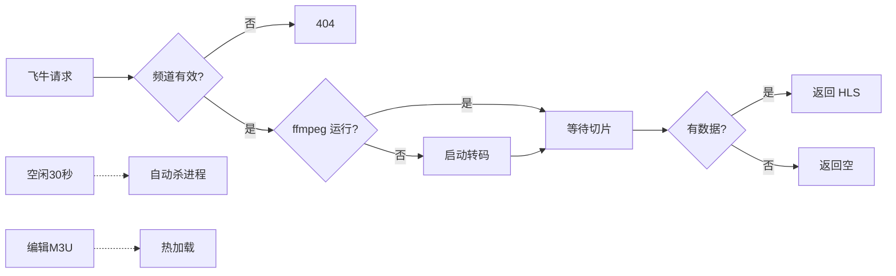

# 飞牛 IPTV 代理

将运营商 RTSP 直播源实时转码为 HLS 流，让飞牛影视内外网均可播放 IPTV 频道。

## 工作流程



## 特性

- **按需转码** — 点播时才启动 ffmpeg，不看自动释放，节省 NAS 资源
- **M3U 热加载** — 编辑频道文件秒级生效，无需重启容器
- **URL 导入** — 支持飞牛 URL 导入方式，改完频道列表刷新即可
- **死源保护** — RTSP 源连接超时自动跳过，不阻塞其他频道
- **台标支持** — 支持 tvg-logo，飞牛可自动拉取频道图标
- **生产级服务** — Waitress WSGI 服务器，比 Flask 开发服务器更稳定
- **并发控制** — 最多同时转码 3 个频道（可调），CPU 内存有硬上限
- **日志输出** — 启动信息和 ffmpeg 启停事件可查看

## 背景

国内运营商 IPTV 直播源通常是 **RTSP 协议 + MPEG-2 编码**，而飞牛影视只支持 **HTTP/HLS 协议 + H.264 编码**，无法直接播放。

本代理在收到飞牛的播放请求时自动启动 ffmpeg，将 RTSP 流转码为 HLS 切片并通过 HTTP 输出。配合反向代理可实现内外网统一播放。

## 前提条件

- 一台能跑 Docker 的 NAS 或服务器
- 已安装飞牛影视
- 有可用的运营商 IPTV 直播源

## 第一步：获取频道数据

需要准备两个文件：

| 文件 | 作用 | 必填 |
|------|------|------|
| `channels.json` | RTSP 地址映射（ch1 → rtsp://...） | 是 |
| `iptv_channels.m3u` | 飞牛显示的频道列表 | 是 |

### 1. 创建 channels.json

`channels.json` 是频道 ID 到 RTSP 地址的映射表，代理靠它知道 ch1、ch2 分别对应哪个 RTSP 源。

如果你有 JSON 格式的 IPTV 源数据（或从运营商接口获取），直接保存即可。如果没有，可以从现有 M3U 文件手动整理，格式如下：

```json
[
  {"id": 1, "name": "CCTV-1高清", "url": "rtsp://..."},
  {"id": 2, "name": "CCTV-2高清", "url": "rtsp://..."}
]
```

> 每个频道必须有唯一的数字 `id`。

### 2. 创建 iptv_channels.m3u

M3U 文件决定飞牛影视里显示哪些频道。格式：

```
#EXTM3U
#EXTINF:-1 tvg-name="CCTV1" tvg-logo="http://epg.51zmt.top:8000/tb1/CCTV/CCTV1.png" group-title="央视频道",CCTV-1高清
http://NAS_IP:18888/ch1/index.m3u8
```

- `ch1` 对应 `channels.json` 里 `id` 为 1 的频道
- `group-title` 控制飞牛里的分组，`tvg-logo` 指定台标（可选）
- IP 改为你 NAS 的 IP 或反向代理域名

如果你已有 M3U 格式的频道列表（含 RTSP 地址），只需把 RTSP 直链替换为代理 URL 格式即可。

## 第二步：部署

在 NAS 上创建目录，放入三个文件：

```
iptv-proxy/
├── channels.json
├── iptv_channels.m3u
└── docker-compose.yml
```

`docker-compose.yml`：

```yaml
services:
  fntv-iptv-proxy:
    image: chanhuan01/fntv-iptv-proxy:latest
    container_name: fntv-iptv-proxy
    restart: unless-stopped
    network_mode: host
    volumes:
      - ./channels.json:/app/channels.json:ro
      - ./iptv_channels.m3u:/app/iptv_channels.m3u:ro
```

启动容器。

## 第三步：导入飞牛影视

**方式一：URL 导入（推荐）**

添加直播源 → URL 导入，填入：

```
http://NAS_IP:18888/iptv.m3u
```

改了频道列表后飞牛刷新即可。

**方式二：文件导入**

上传 `iptv_channels.m3u` 文件。

## 管理频道

直接编辑 NAS 上的 `iptv_channels.m3u`：

- **删除频道**：删掉对应的 `#EXTINF` 行和下一行 URL
- **添加频道**：新增两条，URL 中的 `chXX` 必须对应 `channels.json` 里的 ID
- **改名改分组**：修改 `tvg-name` 和 `group-title`

代理自动检测文件变化，无需重启。

> 新加频道在 `channels.json` 中必须有对应的 RTSP 地址，否则无法播放。

## 查看日志

```bash
docker logs fntv-iptv-proxy
```

正常输出示例：

```
14:30:01 Starting IPTV Proxy — 189 channels in DB, 3 active in M3U
14:30:01 Listening on http://0.0.0.0:18888
14:30:01 M3U: http://NAS_IP:18888/iptv.m3u
14:30:15 Starting ffmpeg for ch1
14:32:00 Stopping ffmpeg for ch1
```

## 配置参数

| 参数 | 默认值 | 说明 |
|------|--------|------|
| `IDLE_TIMEOUT` | 30 秒 | 频道空闲后关闭转码 |
| `MAX_CONCURRENT` | 3 | 最大同时转码数 |
| `-crf` | 20 | 画质（越小越清晰，CPU 越高） |
| `-threads` | 1 | 编码线程数 |

## 故障排查

**导入 M3U 提示格式不正确**
检查 URL 是否以 `http://` 或 `https://` 开头，飞牛不支持 `rtsp://`。

**频道列表正常但无法播放**
执行 `docker logs fntv-iptv-proxy` 查看是否有 ffmpeg 启动日志。无日志则说明 M3U 或 channels.json 配置有问题。

**播放卡顿**
降低 `MAX_CONCURRENT` 到 2 或 1，或调高 `-crf`（如 26）。

**CPU/内存占用高**
每个频道约占用 5-15% CPU 和 80MB 内存。换台后 30 秒自动释放。
